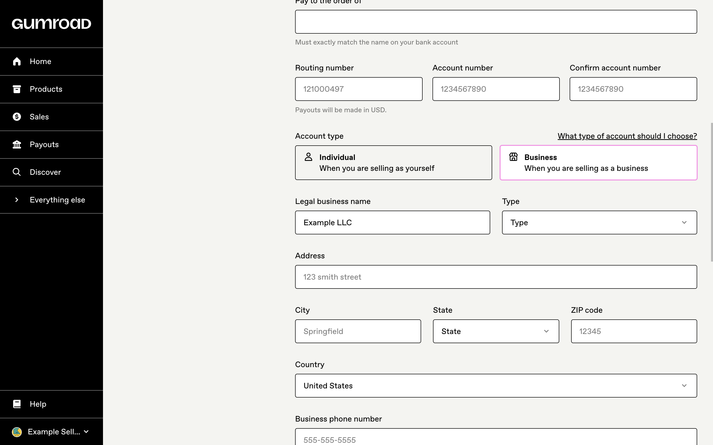
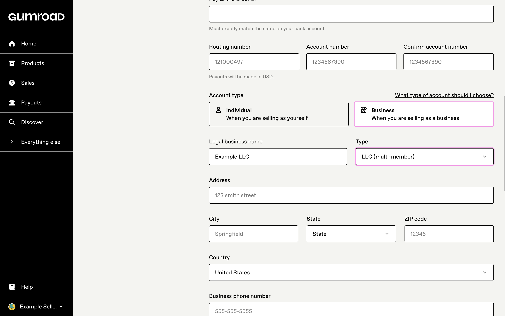
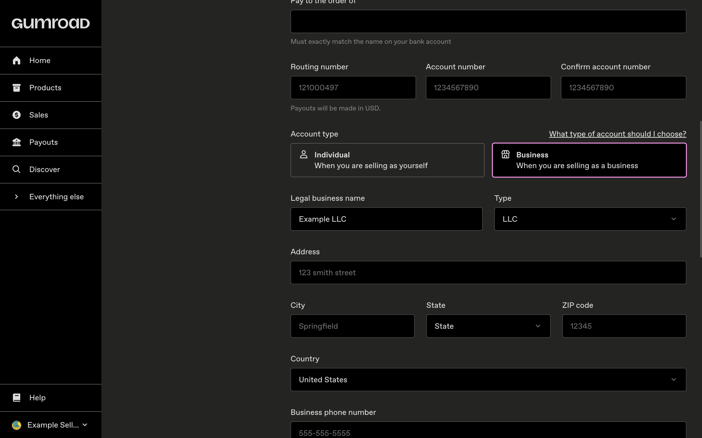
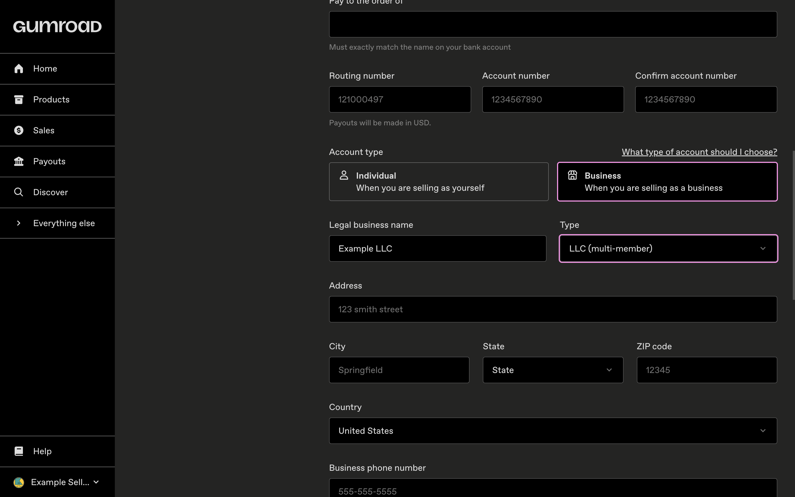
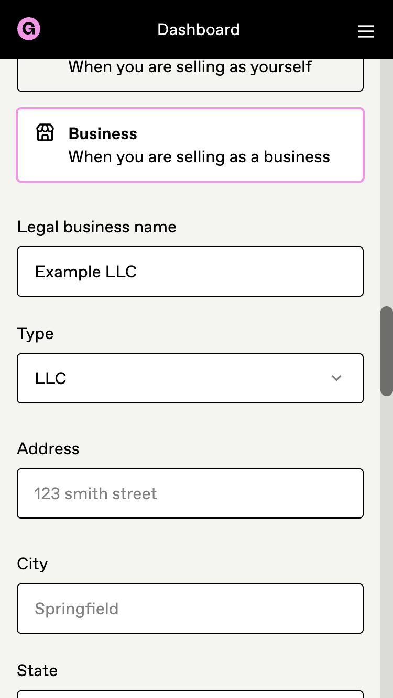
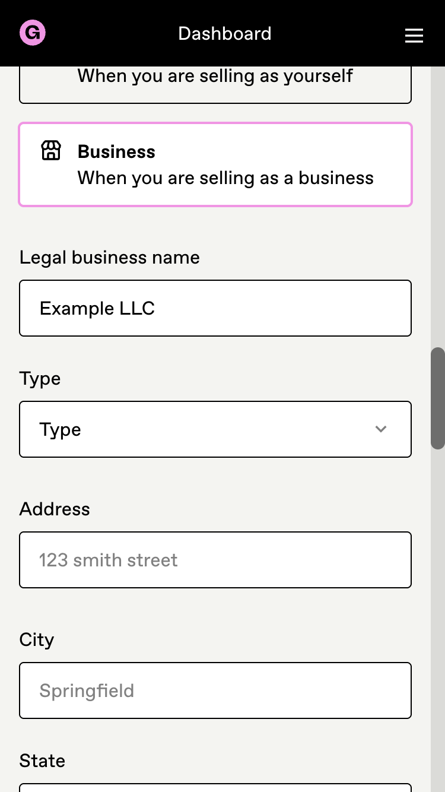
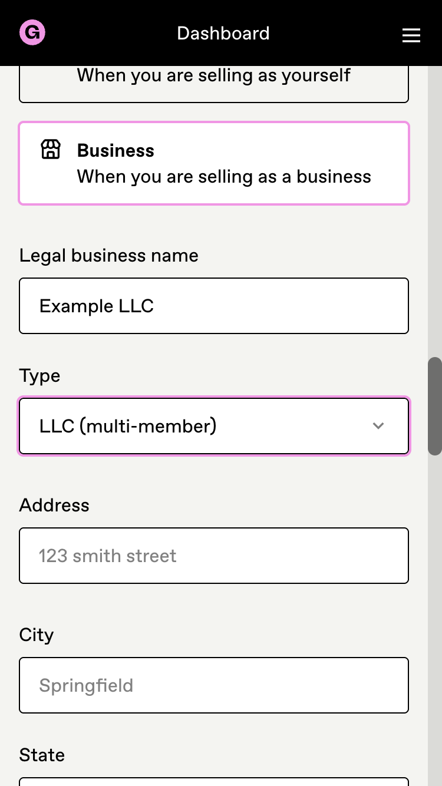
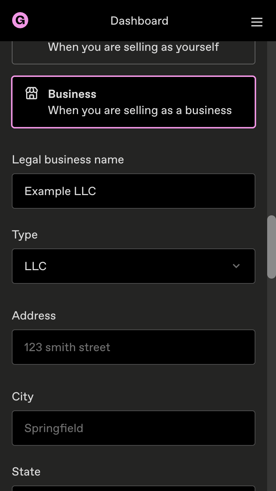
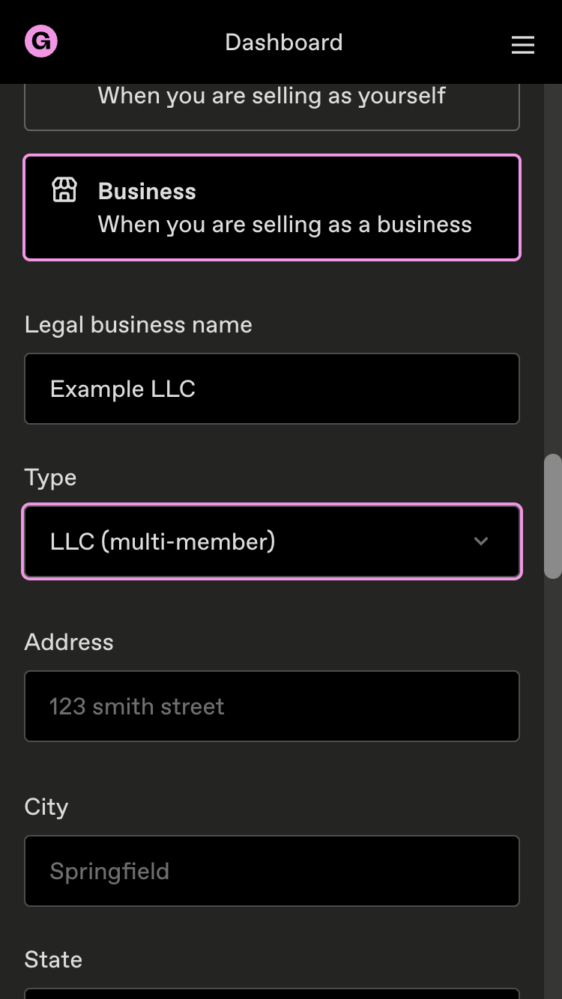

## What / why

Give US businesses separate single-member and multi-member LLC choices and map their declared type to Stripe's US structures. Create/update use the legal-entity country; no member count is inferred for legacy `llc` rows.

Unsupported saved types now show `Type` and cannot save: the dropdown and save validation share the active list. This closes Greptile's P1; the previous appended-legacy-option fix preserved the label but still allowed the invalid save. The two redundant comments were shortened/removed.

## Before / after

Real Rails + Chromium captures with a synthetic seller, desktop (1440px) and mobile (375px), light and dark. Before is `origin/main` at `0bd3d516c13`; after uses the identical application code from `2450f08d242` (this head only adds the browser regression). Legacy US `llc` is shown before, unselected after, then explicitly reselected as `LLC (multi-member)`.

Desktop / light

| Before | Reselection required | After choosing member count |
|---|---|---|
|  |  |  |

Desktop / dark

| Before | Reselection required | After choosing member count |
|---|---|---|
|  |  |  |

Mobile / light

| Before | Reselection required | After choosing member count |
|---|---|---|
|  |  |  |

Mobile / dark

| Before | Reselection required | After choosing member count |
|---|---|---|
|  |  |  |

Captured-state walkthrough (slideshow of the real screenshots, not a real-time recording):

## QA / test results

- [x] On Settings → Payments, a US business saved as `llc` sees `Type`. Update settings marks it invalid using the existing required-fields banner; selecting either LLC member count permits the valid form to submit. Other countries keep their own/generic options.
- [x] Vitest: both payments files, 20 tests passed. Rendering-only revert: 2/9 fail; save-validation-only revert: 1/11 fails. Restored code passes 20/20.
- [x] RSpec: `stripe_merchant_account_manager_spec.rb -e 'US company structure' -e 'company hash keyed on the Stripe account country'`: 19 examples, 0 failures.
- [x] Browser RSpec: saved-EIN edit and legacy LLC reselection → 2 examples, 0 failures. The stale generic-LLC fixture behind Slow 42 was updated; the negative case explicitly verifies that no business type is changed until the seller selects it.
- [x] TypeScript, ESLint on changed components, Prettier, and RuboCop on changed Ruby files pass. Regenerated worktree js-routes before typechecking.
- [ ] Full CI at this head: running (run-all-specs enabled).

Broad local `test-confidence` was stopped during full merge-base replay after its earlier baseline failures; no 99% verdict is claimed. The direct suites above and full exact-head CI are the verification evidence.

## Scope / handoff

AE reach is deliberately unchanged; its evidence-backed decision is recorded on antiwork/gumroad-private#2609. Non-profit structures remain out of scope. No production writes or seller email.

Gianfranco owns human review and merge after CI; no auto-merge. Refs antiwork/gumroad-private#2609.

Premerge review: clean @ e8e99e1f6847ae1ec379d15cfc9104b5bf944d7b

---
AI disclosure: Astra (gpt-6-astra), via Hermes; instructed to finish #2609, address Greptile, capture before/after, decide AE reach using Stripe documentation and read-only production counts, and leave the merge to Gianfranco.
